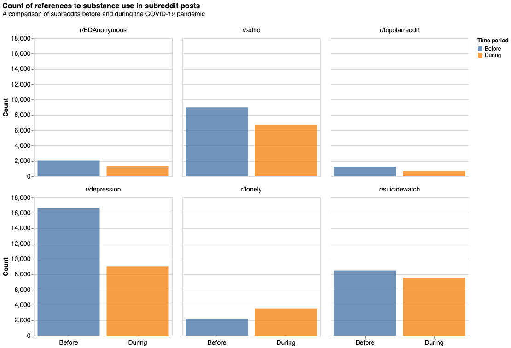

# Methodology

In order to investigate how substance use on Reddit has changed over the pandemic, we first introduce the dataset and conduct an exploratory data analysis (EDA) on several subreddit datasets.
## Data set
The datasets, obtained from a public data resource, is called the [Reddit mental health dataset](https://zenodo.org/record/3941387#.YZl5BC1h1QL), and has been previously processed and organised by Low et al {cite:p}`low2020natural`. The data includes Reddit posts from 826,961 unique users from 2018 to 2020. They provide two CSV files for each period - _before_ (2018-2019) and _during_ (2020) the pandemic - for 15 different subreddits. 

Each observation is a Reddit user's post - a message written on a specific subreddit - which has been processed to extract features that are common in NLP. 

### Feature details
|Feature|Description|
|---|---|
|author|author of the Reddit post|
|date|date of the Reddit post|
|post|raw post text|
|automated_readability_index|a readability metric for English text which measures the understandability of a text|
|coleman_liau_index|a readability metric for English text which measures the understandability of a text|
|flesch_kincaid_grade_level|a readability metric for English text which measures how difficult a piece of text is to understand|
|flesch_reading_ease|${\displaystyle 206.835-1.015\left({\frac {\text{total words}}{\text{total sentences}}}\right)-84.6\left({\frac {\text{total syllables}}{\text{total words}}}\right)}$|
|gulpease_index|a readability metric based on the length of words   the number of words, and the length of sentences.|
|gunning_fog_index|a readability metric for English text which measures the understandability of a text|
|lix|a readability metric for English text which measures how difficult a piece of text is to understand|
|smog_index|a readability metric that measures how many years of education the average person needs to have to understand a text.|
|wiener_sachtextformel|a readability metric which measures the understandability of a text|
|n_chars|number of characters in post|
|n_long_words|number of long words in post|
|n_monosyllable_words|number of monosyllabic words in post|
|n_polysyllable_words|number of polysyllabic words in post|
|n_syllables|number of syllables in post|
|n_unique_words|number of unique words in post|
|n_words|number of words in post|
|sent_neg|negative sentiment score of post|
|sent_neu|neutral sentiment score of post|
|sent_pos|positive sentiment score of post|
|economic_stress_total|count of mentions of economic stress in post|
|isolation_total|count of mentions of isolation in post|
|substance_use_total|count of mentions of substance abuse in post|
|guns_total|count of mentions of guns in post|
|domestic_stress_total|count of mentions of domestic stress in post|
|suicidality_total|count of mentions of suicide in post|
|punctuation|count of punctuation in post|
|LIWC-based metrics|Linguistic Inquiry and Word Count - a metric derived from the degree to which various categories of words are used in a text|
|TF-IDF-based metrics| Term frequency–inverse document frequency - a statistic that is tries to reflect how important a word is in a piece of text|

The feature extractions are as follows (n is the number of columns):
- Linguistic inquiry and word count (LIWC) (n=62);
- Sentiment analysis (n=4); 
- Basic word and syllable counts (n=8); 
- Punctuation (n=1); 
- Readability metrics (n=9); 
- Term frequency–inverse document frequency (TF-IDF) ngrams (256-1024) to capture words and phrases that characterize specific posts; 
- Manually built lexicons about suicidality (n=1), economic stress (n=1), isolation (n=1), substance use (n=1), domestic stress (n=1), and guns (n=1). 

Alongside these features include:
- Author (Reddit user name)
- Date
- Post

For this specific study, we have discarded most of these features from the dataset as they are unrelated to the question in focus. Even though understanding the sentiment of the posts over the pandemic is cruicial to developing a narrative, most of this work has already been conducted by Low et al {cite:p}`info:doi/10.2196/22635`. 
Instead, we have selected one of the text-derived metrics available in this dataset, `substance_abuse_total`, as the focus metric. This value is calculated as the number of references to substance abuse in a Reddit user's post and is a feature that we will use to compare across the _before_ and _during_ pandemic datasets for each subreddit.

Our final processed data sets contained the following features:

- author
- date
- subreddit
- post
- period
- substance_use_total
## Data processing
We used the Python programming language {cite:p}`pypi` and the Pandas library {cite:p}`pandas` to perform the data reading and processing. We automated this process by writing two Python scripts - one that downloads the raw datasets and another that renames columns and reduces the data to the columns of interest. Additionally, we combined the _before_ and _during_ pandemic data sets and introduced a new column `period` to distinguish between the two time frames. This helped to represent the data better and allow us to easily compare the timeframes when conducting the exploratory analysis.
## Data Analysis

We explored the dataset for each of the subreddits and compared the distribution of `substance_use_total` across the two time periods. We found that the differences in the proportion of references to substance use per post per subreddit is not too significant. 

Moreover, from the data analysis we saw that there was a data imbalance based on the time of data collection which can be observed in the next plot. The data for the time period _before_ the pandemic spans 11 months whereas the data at the point of collection only made 3 months of posts _during_ the pandemic available for use.

Deciding which test statistic to use when performing hypothesis tests should depend on the distribution of the data and its characteristics. 
We found that the distribution of `substance_use_total` is skewed, meaning that the average number of references to substance use was not normally distributed. We therefore decided to use the median, as opposed to the mean, for our test estimator. Additionally, the unequal-sized data sets for each `period` allowed us to determine the Wilcoxon rank-sum statistic as a suitable test statistic.

The Wilcoxon rank-sum statistic is a statistic commonly used when comparing two independent samples to assess whether their population median ranks differ. We performed hypothesis tests with a significance level of $\alpha = 0.05$, to determine which subreddits had a statistically significant difference in median number of references to substance abuse over the two time frames. The results are shown in the next section.
